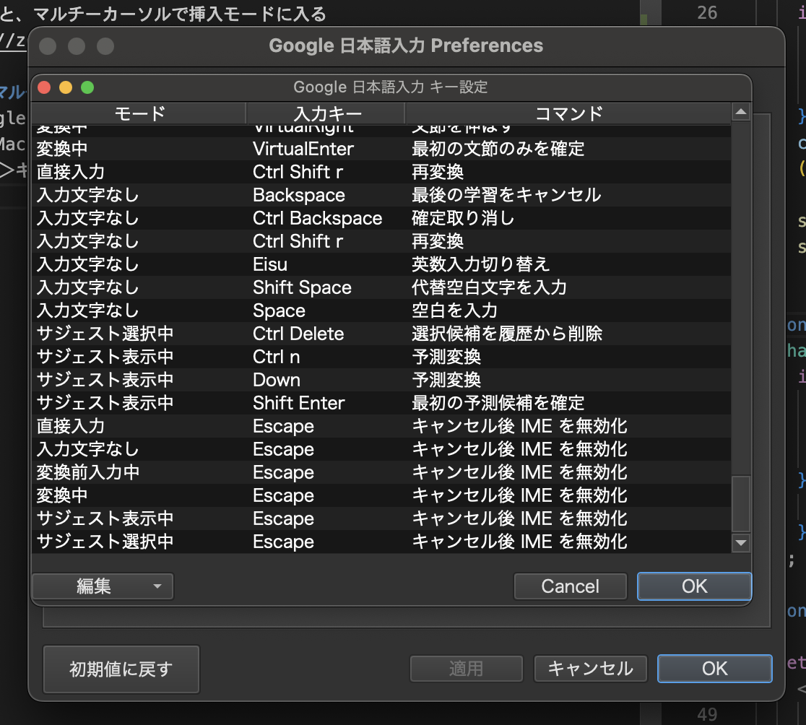

## 矩形入力
1. `0`で行頭にアクセス
2. `v`でビジュアルモードへ
3. 範囲選択
4. `I`で挿入モードへ
5. すると、マルチーカーソルで挿入モードに入る
https://zenn.dev/vim_jp/articles/38915175fe4648

## ノーマルモードで日本語入力に邪魔される問題の解消
1. Google日本語入力の設定を表示
   - Mac：上部ツールバー＞あ＞環境設定
2. 一般＞キー設定＞キー設定の選択 から編集を選択
3. 編集＞エントリーを追加 から「xxx Escape キャンセル後IMEを無効化」を6項目追加する
   - 画像で言うと下から6項目 
   - 直接入力
   - 入力文字梨
   - 変換前入力中
   - 変換中
   - サジェスト表示中
   - サジェスト選択中

